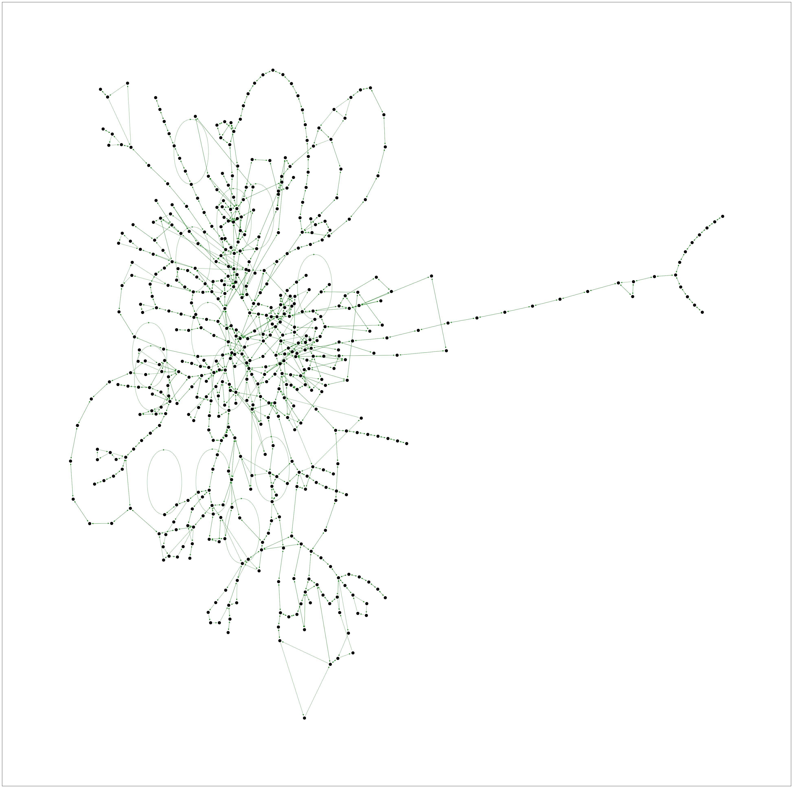
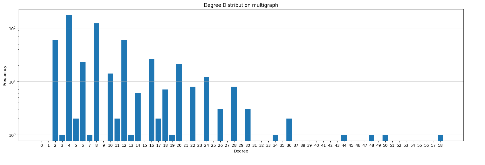
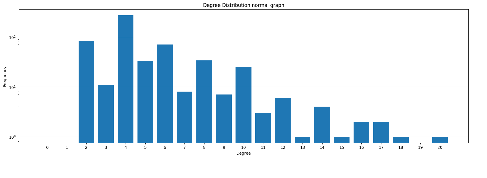
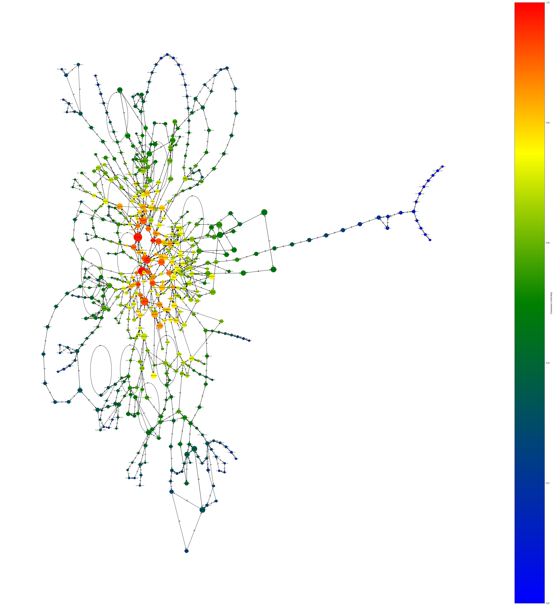
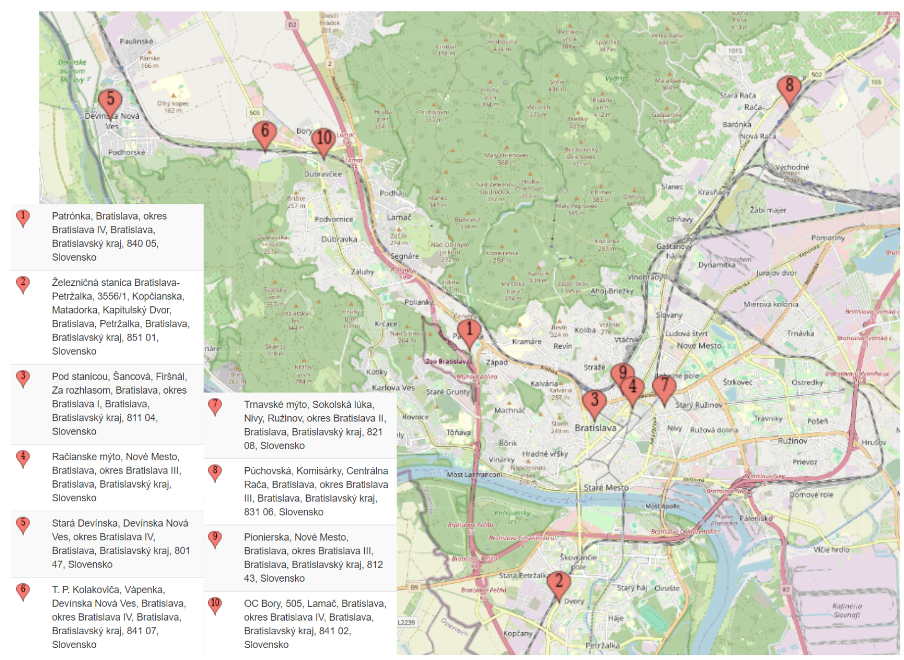
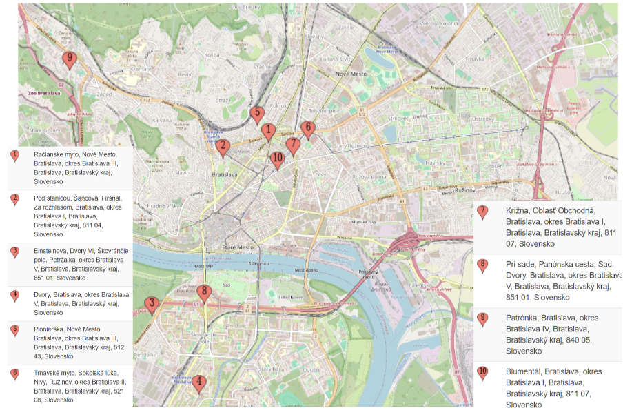
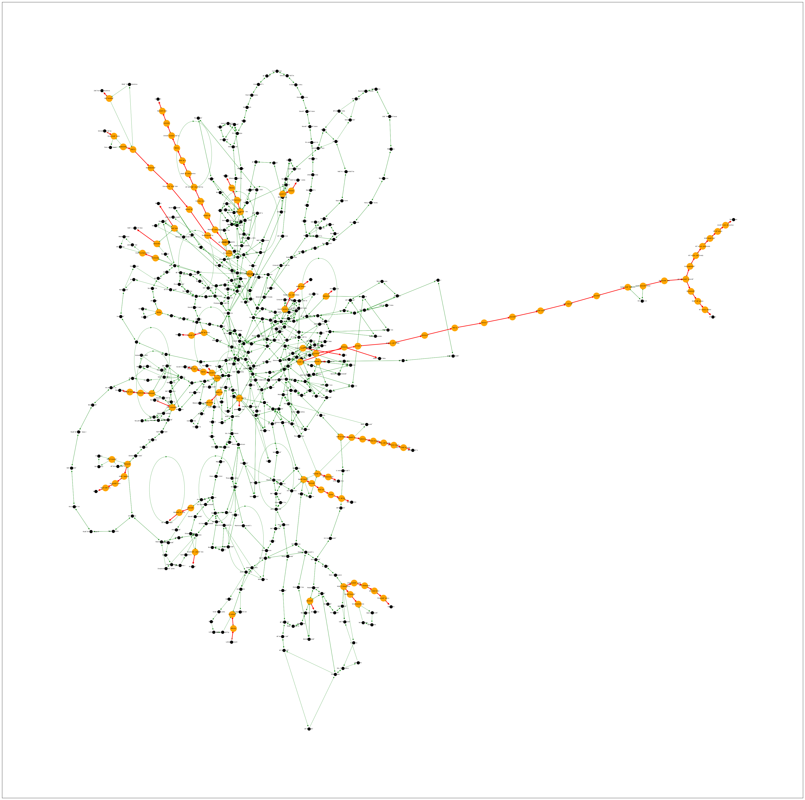

# Bratislavská MHD

## Úvod
Mestská hromadná doprava predstavuje kľúčový prvok verejnej dopravy v mnohých moderných mestách po celom svete. V tomto projekte sa budeme zaoberať rôznymi aspektmi siete tvorenou vybranými zastávkami MHD v meste Bratislava a linkami, ktoré medzi týmito zastávkami premávajú. Cieľom je sa pozrieť na základné štatistické miery siete, výpočet centralit, vyhodnocovanie hustoty siete a podobne. Tieto informácie nám pomôžu odpovedať na niekoľko otázok, ktoré sme si položili. Na to využijeme programovací jazyk Python a knižnicu NetworkX, ktorá umožňujú efektívnu manipuláciu so sieťami a ich analýzu. 

Tu uvádzame niekoľko otázok, na ktoré sa budeme snažiť odpovedať v našom projekte:

1. Ktoré zastávky sú najdôležitejšie v sieti MHD a dôvody prečo sú dôležité? (podľa počtu liniek, ktoré cez ne prechádzajú; či spájajú mestské časti, alebo väčšina z nich je sústredená v jednej časti) 
2. Čo sú slabiny (mosty, artikulácie) v sieti MHD?
3. Aká je priemerná vzdialenosť 2 zastávok (počet zastávok medzi nimi)
4. Ako sa vieme dostať z jednej zastávky do druhej pomocou minimálneho počtu prestupov? 

## Použité dáta

Dáta o prepojenosti zastávok, aktuálne ku 14.4.2024, sme získali [scrapovaním](crawl.py) z webstránky [MHD Bratislava](https://imhd.sk/ba/). Stránka obsahuje informácie o spojoch v Bratislavskej MHD spolu so zastávkami v oboch smeroch pre danú linku. Pre jednoduchosť sme použili len tie, ktoré mali číslo menšie ako 200. Linky s číslom nad 200 už zahŕňajú regionálne linky, ktoré obsluhujú obce mimo Bratislavy. Taksito sme nepoužili nočné linky a vlakové spojenia.

Scrapovali sme pomocou pythonovského programu a dáta sme uložili do súboru [linky.txt](linky.txt). Každý riadok súbor sa začína číslom linky, za ktorým nasleduje postupnosť zastávok, cez ktoré daná linka ide. Keďže niektoré linky majú rozdielne zastávky v opačnom smere, je potrebné uložiť si postupnosť zastávok v oboch smeroch.

## Základné informácie a štatistická charakterizácia siete

Sieť, ktorú sme vytvorili získaním dát má 564 vrcholov a 1416 hrán. Priemerný stupeň vrchola je 5.02, čiže v priemere sa vieme z každej zastávky dostať na 5 rôznych susediacich zastávok. 

Tieto a ďalšie základné charakteristiky siete, s ktorou pracujeme, uvádzame v nasledujúcej tabuľke.
| Vlastnosť siete  | Hodnota |
| ------------- | ------------- |
| Počet vrcholov | 564  |
| Počet hrán | 1416 |
| Priemerný stupeň vrchola | 5.02  |
| Hustota | 0.0045  |
| Zhlukový koeficient | 0.098 |
| Počet silne súvislých komponentov | 1  |

Ako môžeme vidieť, celá sieť tvorená zastávkami MHD vytvára jeden silne súvislý komponent súvislosti. Nízka hustota ukazuje, že MHD sieť je riedka a zároveň relatívne nízky zhlukový koeficient zrejme hovorí o tom, že cestujúci nemusia mať priamy spoj medzi niektorými zastávkami a musia preto prestupovať medzi viacerými linkami, aby sa dostali do cieľovej zastávky. 

Na tomto obrázku môžeme vidieť skúmanú sieť. Pre veľkosť siete by bolo veľmi neprehľadné uvádzať názvy jednotlivých zastávok do tejto vizualizácie, preto sa na niektoré špecifické zastávky pozrieme neskôr.

## Rozdelenie stupňov vrcholov (Degree Distribution)

### Histogram 1

### Histogram 2

## Najdôležitejšie zastávky v MHD
Ako sme už povedali vyššie, MHD predstavuje kľúčový prvok verejnej dopravy v mnohých moderných mestách a Bratislava nie je výnimkou. 
Na obrázku môžeme vidieť graf reprezentujúci linky MHD v Bratislave. Veľkosť vrchola reprezentuje centralitu stupňa vrchola a farba reprezentuje centralitu blízkosti. Farebná škála ide od modrej, ktorá reprezentuje najmenšiu centralitu až po červenú, ktorá reprezentuje najväčšiu centralitu.

### Centralita stupňa vrchola (Degree Centrality)
Body s vysokou centralitou stupňa vrchola, v našom prípade zastávky, sú miesta, z ktorých sa vieme dostať na rôzne smery. Zrejme to môžu byť miesta v blízkosti nákupných centier, kancelárskych budov, alebo pri veľkých križovatkách, ktoré slúžia ako prestupný bod na viaceré miesta. Keď sa pozrieme na mapu, táto myšlienka sa potvrdzuje napríklad pri Trnavskom mýte. Konkrétne Trnavské mýto je všeobecne známe tým, že z neho premávajú autobusy, trolejbusy a električky. Taktiež si môžeme všimnúť aj rozpoloženie týchto zastávok. Predpokladali sme, že niektoré zastávky budú sústredné na jednom mieste, konkrétne, v okoli centra Bratislavy. Naopak, väčšina týchto zastávok je rozprestretá po celej Bratislave. Môžeme teda povedať, že zastávky, ktoré majú vysokú centralitu stupňa vrchola slúžia ako dôležité prestupné body, na ktorých vieme prestúpiť na množstvo iných liniek, z ktorých sa vieme dostať na iné dôležité miesta ako je letisko, železničná stanica a podobne. 

### Centralita blízkosti (Closeness Centrality)

Vrcholy - zastávky s vysokou centralitou blízkosti by mohli predstavovať tie zastávky, ktoré sú veľmi dobre spojené so všetkými ostatnými zastávkami v sieti MHD. Tieto zastávky by mali byť umiestnené tak, aby poskytovali efektívny prístup k rôznym častiam mesta a mohli slúžiť ako dôležité uzly v sieti MHD. Tieto zastávky by mohli tieži slúžiť ako dôležité uzly, ktoré umožňujú cestujúcim rýchlo sa dostať z jedného miesta na druhé. Na nasledujúcom obrázku môžeme vidieť, že väčšia časť týchto zastávok sa nachádza v okolí Hlavnej stanice a Nového a Starého mesta. Patria tam zastávky ako napríklad Pod stanicou alebo Trnavské mýto. 

### Centralita prepojenosti? (Betweenness Centrality)

## Slabiny v sieti MHD
V rámci analýzy siete MHD sme identifikovali oblasti, kde by potenciálne mohlo dochádzať k problémom v prípade, že sa poškodí cesta, zastávka a podobne. Na niektorých úsekoch nie je vôbec možné dopravu presmerovať cez existujúce zastávky. Takéto zastávky sme identifikovali a je ich pomerne dosť. Znázorňujeme ich aj na nasledujúcom grafe, pre veľkosť siete sa nám nepodarilo dať do tohto reportu dostatočne veľký obrázok, preto sme ho uložili aj na GitHub ako articul.png. Zo zastávok, ktoré sú v našej sieti artikuláciami, vyberáme dve, ktoré z predchádzajúcej analýzy považujeme za veľmi dôležité:

* **Stn. Vinohrady**: v prípade rekonštrukcie cesty v okolí tejto zastávky by sa museli zaviesť náhradné zastávky niekde pri Stn. Vinohrady, aby sa dalo dostať na smer Horáreň Krásňany
* **Trnavské mýto**: táto zastávka nás celkom prekvapila. Dôvod toho, že je artikuláciou je ten, že z neho vedie cesta na zastávku Jelačičova, na ktorú sa ide len cez Trnavské mýto. 

Netreba však zanedbať ani ostatné zastávky, ktoré sú uzlami. Často je to však z toho dôvodu, že priamo z Bratislavy vedie do okrajových častí len jedna cesta a teda často buď jeden spoj, alebo niekoľko spojov, pričom každý končí na nejakej inej zastávke. Dalo by sa teda konštatovať, že slabinou MHD siete je, že pokiaľ by sa mala rekonštruovať cesta napríklad smerom do Rusoviec, znamenalo by to vytvorenie kompletnej obchádzkovej trasy cez úplne iné ulice. 

## Najmenší počet prestupov

Dôležitým a praktickým faktorom cestovania pre nás, autorov, je dostať sa z jedného miesta na druhé čo najjednoduchšie. 

Vytvorenie siete Bratislavskej mhd.
Program crawl.py získal linky a zastávky z https://imhd.sk/ba/cestovne-poriadky a uložil ich do súboru linky.txt
linky.txt Je vo formáte číslo linky: zástavka1;zástavka2;zástavka3;....................;zastávkan
Program graph.ipynb načíta súbor linky.txt a vytvorý graf sieti mhd.  Tento graf je orientovaný, lebo existujú medzi zástavkami iba jednosmerné spojenia a je to multigraf, lebo madzi zastávkymi môže premávať viac liniek. Graf je uložený ako 2D slovník, kde graph[zastávka1][zastávka2] = x, zanemá že z prvej zastávky do druhej ide x liniek.
krelsenie grafu.py je program čo vygeneruje náhodný graf a nakrelí ho, vrcholy sú zafarbené podľa spojenosti( alebo centrality už si nie som istý). graf sa otvarí v prehliadači.

link na report https://docs.google.com/document/d/1pHp0rORXtKSpdfbTBlz6ld8ac9qV1hk0nLgn_M13WB4/edit?usp=sharing
link na colab s grafom https://colab.research.google.com/drive/1KxDKzoMGsNsfTO51mOG_hhd-zSiI1w_1?usp=sharing

