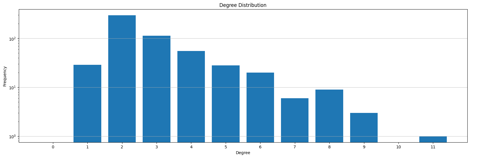
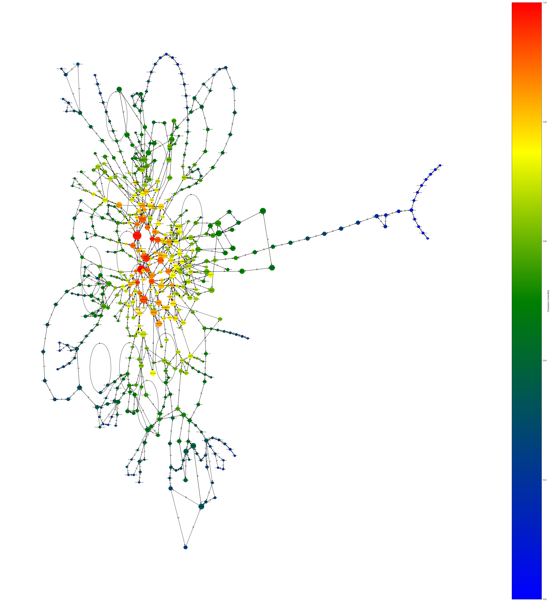
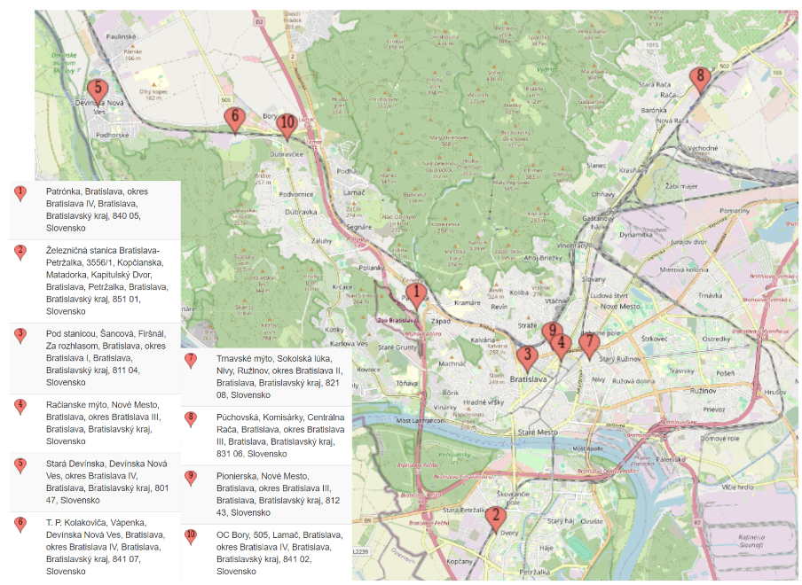
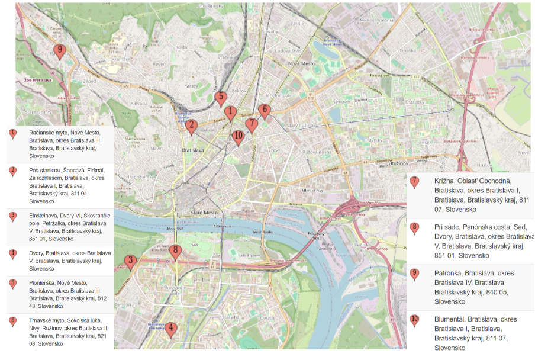
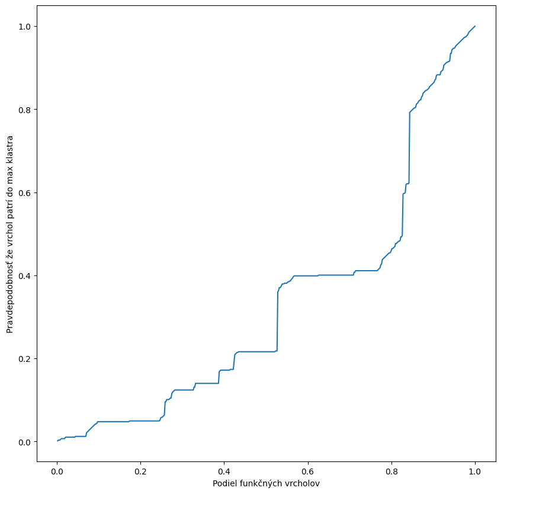
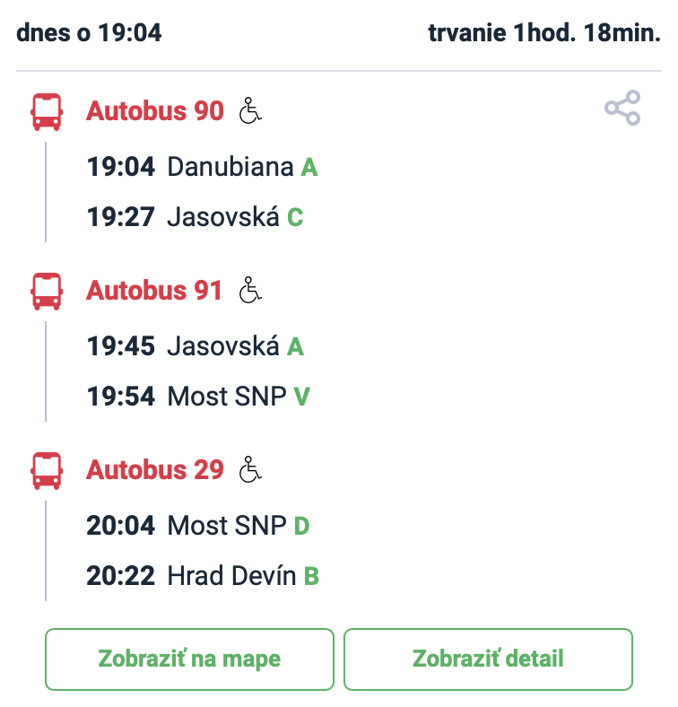
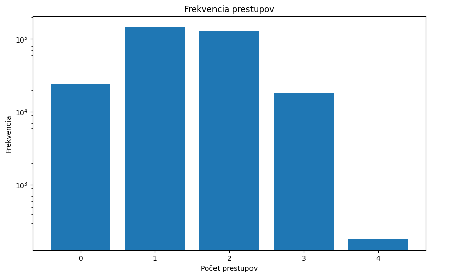

# Bratislavská MHD

**Autori projektu:** Barbora Bezáková, Kristián Nosko, Jakub Caban

## Úvod
Mestská hromadná doprava predstavuje kľúčový prvok verejnej dopravy v mnohých moderných mestách po celom svete. V tomto projekte sa budeme zaoberať rôznymi aspektmi siete tvorenou vybranými zastávkami MHD v meste Bratislava a linkami, ktoré medzi týmito zastávkami premávajú. Cieľom je sa pozrieť na základné štatistické miery siete, výpočet centralit, vyhodnocovanie hustoty siete a podobne. Tieto informácie nám pomôžu odpovedať na niekoľko otázok, ktoré sme si položili. Na to využijeme programovací jazyk Python a knižnicu NetworkX, ktorá umožňujú efektívnu manipuláciu so sieťami a ich analýzu. 

Tu uvádzame niekoľko otázok, na ktoré sa budeme snažiť odpovedať v našom projekte:

1. Ktoré zastávky sú najdôležitejšie v sieti MHD a dôvody prečo sú dôležité? (podľa počtu liniek, ktoré cez ne prechádzajú; či spájajú mestské časti, alebo väčšina z nich je sústredená v jednej časti) 
2. Čo sú slabiny (mosty, artikulácie) v sieti MHD?
3. Aká je priemerná vzdialenosť 2 zastávok (počet zastávok medzi nimi)
4. Ako sa vieme dostať z jednej zastávky do druhej pomocou minimálneho počtu prestupov? 

## Použité dáta

Dáta o prepojenosti zastávok, aktuálne ku 14.4.2024, sme získali [scrapovaním](crawl.py) z webstránky [MHD Bratislava](https://imhd.sk/ba/). Stránka obsahuje informácie o spojoch v Bratislavskej MHD spolu so zastávkami v oboch smeroch pre danú linku. Pre jednoduchosť sme použili len tie, ktoré mali číslo menšie ako 200. Linky s číslom nad 200 už zahŕňajú regionálne linky, ktoré obsluhujú obce mimo Bratislavy. Taksito sme nepoužili nočné linky a vlakové spojenia.

Scrapovali sme pomocou pythonovského programu a dáta sme uložili do súboru [linky.txt](linky.txt). Každý riadok súbor sa začína číslom linky, za ktorým nasleduje postupnosť zastávok, cez ktoré daná linka ide. Keďže niektoré linky majú rozdielne zastávky v opačnom smere, je potrebné uložiť si postupnosť zastávok v oboch smeroch.

Súbor so zastávkami obsahuje riadky vo formáte 
```číslo linky: zástavka1;zástavka2;zástavka3;....................;zastávkan```

## Základné informácie a štatistická charakterizácia siete

Sieť, ktorú sme vytvorili získaním dát má 564 vrcholov a 1416 hrán. Priemerný stupeň vrchola je 5.02, čiže v priemere sa vieme z každej zastávky dostať na 5 rôznych susediacich zastávok. 

Tieto a ďalšie základné charakteristiky siete, s ktorou pracujeme, uvádzame v nasledujúcej tabuľke.
| Vlastnosť siete  | Hodnota |
| ------------- | ------------- |
| Počet vrcholov | 564  |
| Počet hrán | 1416 |
| Priemerný stupeň vrchola | 5.02  |
| Hustota | 0.0045  |
| Zhlukový koeficient | 0.098 |
| Počet silne súvislých komponentov | 1  |

Ako môžeme vidieť, celá sieť tvorená zastávkami MHD vytvára jeden silne súvislý komponent súvislosti. Nízka hustota ukazuje, že MHD sieť je riedka a zároveň relatívne nízky zhlukový koeficient zrejme hovorí o tom, že cestujúci nemusia mať priamy spoj medzi niektorými zastávkami a musia preto prestupovať medzi viacerými linkami, aby sa dostali do cieľovej zastávky. 

Na tomto obrázku môžeme vidieť skúmanú sieť. Pre veľkosť siete by bolo veľmi neprehľadné uvádzať názvy jednotlivých zastávok do tejto vizualizácie, preto sa na niektoré špecifické zastávky pozrieme neskôr.
<p align="center">

</p>

## Rozdelenie stupňov vrcholov (Degree Distribution)

### Histogram 1

Na tomto obrázku vidíme rozdelenie stupňa vrcholov. Môžeme si všimnúť, že najviac zastávok má práve 2 susediace zastávky, ale existuje aj zastávka s 11 susediacimi zastávkami. Ide o zastávku *Patrónka* a susedia s ňou tieto zastávky: ```['Pod stanicou', 'Mokrohájska', 'Vrančovičova', 'Habánsky mlyn', 'Suchý mlyn', 'Červený most', 'Hýrošova', 'Stn. Lamač', 'Hroboňova', 'Dubová', 'Valašská']```. 

<p align="center">

</p>

## Najdôležitejšie zastávky v MHD
Ako sme už povedali vyššie, MHD predstavuje kľúčový prvok verejnej dopravy v mnohých moderných mestách a Bratislava nie je výnimkou. 
Na obrázku môžeme vidieť graf reprezentujúci linky MHD v Bratislave. Veľkosť vrchola reprezentuje centralitu stupňa vrchola a farba reprezentuje centralitu blízkosti. Farebná škála ide od modrej, ktorá reprezentuje najmenšiu centralitu až po červenú, ktorá reprezentuje najväčšiu centralitu. Na jednotlivé zastávky, ktoré majú vysokú centralitu stupňa vrchola alebo centralitu blízkosti sa pozrieme detailnejšie.

<p align="center">

</p>

### Centralita stupňa vrchola (Degree Centrality)
Body s vysokou centralitou stupňa vrchola, v našom prípade zastávky, sú miesta, z ktorých sa vieme dostať na rôzne smery. Zrejme to môžu byť miesta v blízkosti nákupných centier, kancelárskych budov, alebo pri veľkých križovatkách, ktoré slúžia ako prestupný bod na viaceré miesta. Keď sa pozrieme na mapu, táto myšlienka sa potvrdzuje napríklad pri Trnavskom mýte. Konkrétne *Trnavské mýto* je všeobecne známe tým, že z neho premávajú autobusy, trolejbusy a električky. Taktiež si môžeme všimnúť aj rozpoloženie týchto zastávok. Predpokladali sme, že niektoré zastávky budú sústredné na jednom mieste, konkrétne, v okoli centra Bratislavy. Naopak, väčšina týchto zastávok je rozprestretá po celej Bratislave. Môžeme teda povedať, že zastávky, ktoré majú vysokú centralitu stupňa vrchola slúžia ako dôležité prestupné body, na ktorých vieme prestúpiť na množstvo iných liniek, z ktorých sa vieme dostať na iné dôležité miesta ako je letisko, železničná stanica a podobne. 

<p align="center">

</p>

### Centralita blízkosti (Closeness Centrality)

Vrcholy - zastávky s vysokou centralitou blízkosti by mohli predstavovať tie zastávky, ktoré sú veľmi dobre spojené so všetkými ostatnými zastávkami v sieti MHD. Tieto zastávky by mali byť umiestnené tak, aby poskytovali efektívny prístup k rôznym častiam mesta a mohli slúžiť ako dôležité uzly v sieti MHD. Tieto zastávky by mohli tieži slúžiť ako dôležité uzly, ktoré umožňujú cestujúcim rýchlo sa dostať z jedného miesta na druhé. Na nasledujúcom obrázku môžeme vidieť, že väčšia časť týchto zastávok sa nachádza v okolí Hlavnej stanice a Nového a Starého mesta. Patria tam zastávky ako napríklad Pod stanicou alebo Trnavské mýto. 

<p align="center">

</p>

## Slabiny v sieti MHD
V rámci analýzy siete MHD sme identifikovali oblasti, kde by potenciálne mohlo dochádzať k problémom v prípade, že sa poškodí cesta, zastávka a podobne. Na niektorých úsekoch nie je vôbec možné dopravu presmerovať cez existujúce zastávky. Takéto zastávky sme identifikovali a je ich pomerne dosť. Znázorňujeme ich aj na nasledujúcom grafe. Zo zastávok, ktoré sú v našej sieti artikuláciami, vyberáme dve, ktoré z predchádzajúcej analýzy považujeme za veľmi dôležité:

<p align="center">

</p>

* **Stn. Vinohrady**: v prípade rekonštrukcie cesty v okolí tejto zastávky by sa museli zaviesť náhradné zastávky niekde pri Stn. Vinohrady, aby sa dalo dostať na smer Horáreň Krásňany
* **Trnavské mýto**: táto zastávka nás celkom prekvapila. Dôvod toho, že je artikuláciou je ten, že z neho vedie cesta na zastávku Jelačičova, na ktorú sa ide len cez Trnavské mýto. 

Netreba však zanedbať ani ostatné zastávky, ktoré sú uzlami. Často je to však z toho dôvodu, že priamo z Bratislavy vedie do okrajových častí len jedna cesta a teda často buď jeden spoj, alebo niekoľko spojov, pričom každý končí na nejakej inej zastávke. Dalo by sa teda konštatovať, že slabinou MHD siete je, že pokiaľ by sa mala rekonštruovať cesta napríklad smerom do Rusoviec, znamenalo by to vytvorenie kompletnej obchádzkovej trasy cez úplne iné ulice. 

## Perkolácia v sieti

Rozhodli sme sa experimentovať aj s odstraňovaním náhodných vrcholov a sledovať jej prepojenosť. Pri odstránení 20% náhodných vrcholov prepojenosť siete začína zásadne klesať. V realite by to mohlo znamenať, že ak by sa z nejakého vážneho dôvodu obmedzila premávka v Bratislave, vážne by to ovplyvnilo aj MHD. Postupné odstraňovanie vrcholov v sieti ilustruje nasledujúci obrázok. 
<p align="center">

</p>


## Najmenší počet prestupov

Dôležitým a praktickým faktorom cestovania pre nás, autorov, je dostať sa z jedného miesta na druhé čo najjednoduchšie - s minimálnym množstvom prestupov. A myslíme si, že to zaujíma aj iných cestujúcich. Preto sme sa rozhodli zistiť, aký je priemerný, najmenší a najväčší počet prestupov, keď sa chceme dostať vrámci Bratislavy z bodu A do bodu B. 

Na vypočítanie minimálneho počtu prestupov sme zostrojili bipartitný graf. Na jednej strane sú ako vrcholy grafu čísla liniek a na druhej strane sú vrcholmi jednotlivé zastávky. Ak linka číslo 1 prechádzala cez zastávku A, tak 1 a A sú spojené hranou. Po vytvorení vhodnej reprezentácie našich dát sme problém transformovali na hľadanie najkratšej cesty v grafe. Spravili sme program, ktorý vypísal postupnosť vrcholov, cez ktoré prechádzame a z tých sme počítali koľko krát sme prešli cez vrchol s číslom linky. Od tohto čísla odpočítame jedna a to určuje počet prestupov. 
Vytvorili sme teda maticu, kde sme si uložili minimálne počty prestupov pre každú dvojicu zastávok. Táto matica má na diagonále 0, nakoľko zo zastávky A do zastávky A nepotrebujeme žiaden prestup. 

Napríklad pre ```least_transfer["Danubiana"]["Hrad Devín"]``` sme získali takúto cestu s najmenším počtom prestupov: ```['Danubiana', '90', 'Landererova', '50', 'Most SNP', '29', 'Hrad Devín']```. Po porovnaní s fungujúcou aplikáciou iMHD sme si overili, či je pravda, že sa skutočne potrebujeme prepraviť dokopy 3 linkami. Tu je jedna z možností, ktorú nám ponúkla táto webstránka. Ponúkla nám síce inú kombináciu liniek, ale aj tak na to potrebujeme 3 rôzne linky a teda 2 prestupy. 
<p align="center">

</p>

Priemerný počet prestupov pre všetky kombinácie liniek vrámci MHD je 1.44. 
Na tomto histograme môžeme vidieť, že ak chceme cestovať vrámci Bratislavy na nejakú zo zastávok v našej sieti, potrebujeme na to maximálne 4 prestupy. 
<p align="center">

</p>

## Záver

Tento projekt nám poskytol detailný pohľad na štruktúru a vlastnosti siete mestskej hromadnej dopravy v Bratislave. Pomocou nástrojov na analýzu sietí sme dokázali odpovedať na niekoľko kľúčových otázok týkajúcich sa fungovania a efektivity tejto siete.

Z našej analýzy vyplýva, že niektoré zastávky, ako napríklad *Trnavské mýto* a *Stn. Vinohrady*, sú kľúčovými bodmi v sieti, ktoré zabezpečujú plynulú premávku a prepojenie rôznych častí mesta. Tieto zastávky majú vysokú centralitu stupňa vrchola a blízkosti, čo znamená, že sú dôležitými uzlami nielen pre cestujúcich, ale aj pre celkovú stabilitu siete.

Na druhej strane, identifikovali sme aj slabiny siete, ktoré by mohli spôsobiť problémy v prípade výpadku niektorých spojov alebo rekonštrukcií ciest. Tieto slabiny naznačujú potrebu posilnenia niektorých častí siete a lepšieho plánovania alternatívnych trás.

Experiment s perkoláciou ukázal, že odstránenie 20% percent vrcholov môže zásadne ovplyvniť prepojenosť celej siete. Toto zistenie je dôležité pre plánovanie a zabezpečenie odolnosti MHD proti výpadkom.

Analýza minimálneho počtu prestupov pre cestovanie medzi zastávkami odhalila, že priemerný počet prestupov je relatívne nízky, čo je pozitívne pre cestujúcich. Maximálny počet prestupov, ktorý sme identifikovali, je štyri, čo je akceptovateľné vzhľadom na veľkosť a komplexnosť siete.

Na záver, náš projekt nám priniesol hodnotné poznatky, ktoré by po detailnejšej analýze mohli byť využité pre zlepšenie a optimalizáciu MHD v Bratislave. 

### *Podiel práce na projekte:*

Jakub Caban: $\\frac{1}{3}\$
* scrapovanie zo stránky imhd
* načítanie grafu z *txt* súboru, vytvorenie grafu v networkx
* výpočet centralít, najkratšie cesty v grafe
  
Barbora Bezáková: $\\frac{1}{3}\$
* interpretácia výsledkov výpočtu centralít
* rozdelenie stupňov vrcholov
* slabiny v sieti, najkratšie cesty

Kristián Nosko: $\\frac{1}{3}\$
* položenie výskumných otázok, debugging kódu
* niektoré základné charakteristiky siete + perkolácia, vytvorenie máp pre dôležité zastávky v našej sieti
* preštylizovanie reportu, tvorba prezentácie
